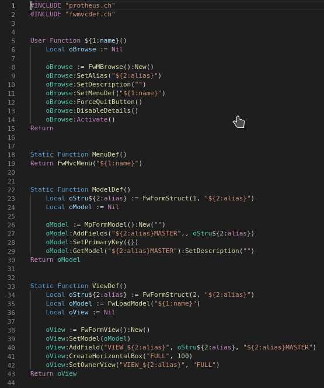
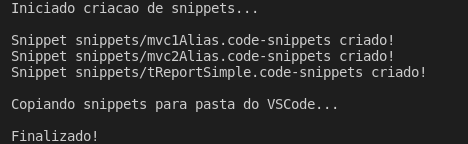
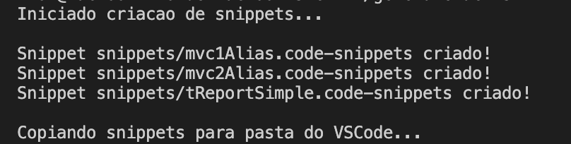
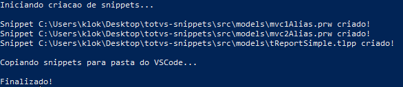
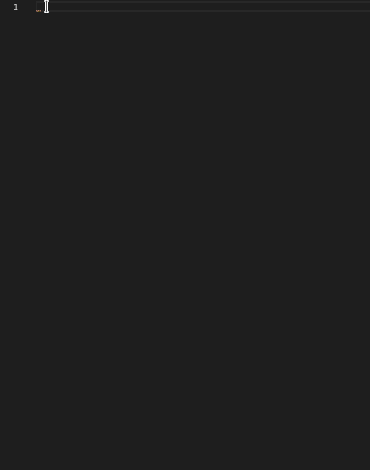

# totvs-snippets

Script realiza a conversão de código Advpl ou TL++ para um snippet do VSCode.

<br />

1. [Definição](#Definição)
1. [Criando códigos modelos](#Criando-códigos-modelos)
1. [Geração do snippet em Linux](#Geração-do-snippet-em-Linux)
1. [Geração do snippet em MacOS](#Geração-do-snippet-em-MacOS)
1. [Geração do snippet em Windows](#Geração-do-snippet-em-Windows)
1. [Utilizando os snippets](#Utilizando-os-snippets)

<br />

## Definição

Não é de hoje que o uso de snippet facilitam a vida do desenvolvedor, principalmente em codigos rotineiros.
Esse script visa facilitar a criação desses snippets Advpl e TL++ para uso no VSCode. Basta criar seus códigos na pasta **models/** e depois realizar a geração com um dos scripts fornecidos, escolhendo entre ambientes Linux ou Windows.

<br />

## Criando códigos modelos

Para facilitar a criação de snippets, basta criar o código desejado diretamente em Advpl ou TL++ na pasta **models/**, dessa forma não é necessário criar o snippet no formato JSON padrão do VSCode, pois o nosso script fará essa conversão posteriormente.

Exemplo de uma tela MVC muito simples na pasta **models/**:



Veja que é um código Advpl padrão, com apenas algumas mudanças, que são OPCIONAIS, no caso as chaves que serão subtituidas quando o snippet foi utilizado.

No exemplo acima utilizamos 2 (duas) chaves:

- **${1:name}** Será substituida pelo nome da função/fonte.
- **${2:alias}** Será substituida Alias que o MVC se refere.

Na sessão [Utilizando os snippets](#Utilizando-os-snippets) exemplificamos essas chaves sendo substituidas.

<br />

## Geração do snippet em Linux

Para executar o script em linux use o arquivo **generateLinux.sh**, escrito em shell script.

Navegar até a pasta do script:
```shellscript
cd [CAMINHO]/totvs-generate-snippets/src/
```

Dar permissão de execução:

```shellscript
chmod +x generateLinux.sh
```

Executar:

```shellscript
./generateLinux.sh
```

Após executar no console deve aparecer algo parecido com:



<br />

Os snippets gerados são copiados diretamente para a pasta:


`/home/$USER/.config/Code/User/snippets/`

<br />

## Geração do snippet em MacOS

Para executar o script em MacOS use o arquivo **generateMac.zsh**, escrito em shell script.

Navegar até a pasta do script:
```zsh
cd [CAMINHO]/totvs-generate-snippets/src/
```

Dar permissão de execução:

```zsh
chmod +x generateMac.sh
```

Executar:

```zsh
./generateMac.sh
```

Após executar no console deve aparecer algo parecido com:



<br />

Os snippets gerados são copiados diretamente para a pasta:


`/Users/$USER/Library/Application Support/Code/User/snippets/`

<br />

## Geração do snippet em Windows

Para executar o script em windows use o arquivo **generateWindows.ps1**, escrito em powershell.

Navegar até a pasta do script:
```powershell
cd [CAMINHO]/totvs-generate-snippets/src/
```

Executar:

```powershell
.\generateWindows.ps1
```

Após executar no console deve aparecer algo parecido com:



<br />

Os snippets gerados são copiados diretamente para a pasta:


`$HOME\AppData\Roaming\Code\User\snippets\`

<br />

## Utilizando os snippets

Para fazer uso de um snippet basta digitar o nome do fonte criado na pasta **models/**, que o mesmo já vai aparecer no seu VSCode, uma vez digitado selecione ele e caso tenham chaves para substituir faça nesse momento, veja o exemplo abaixo:



